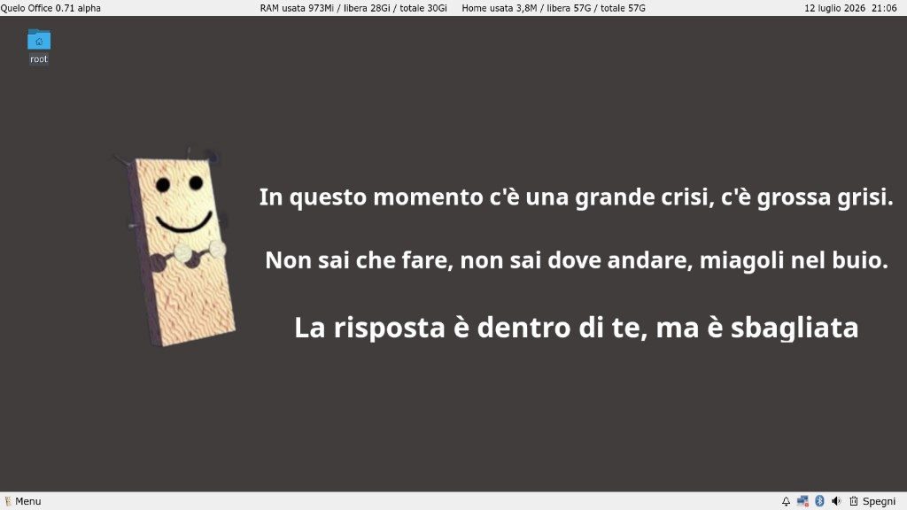
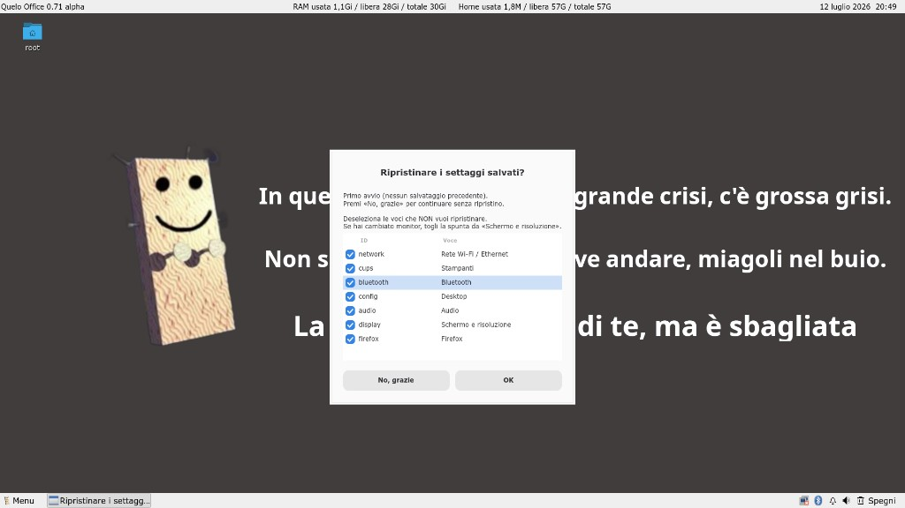
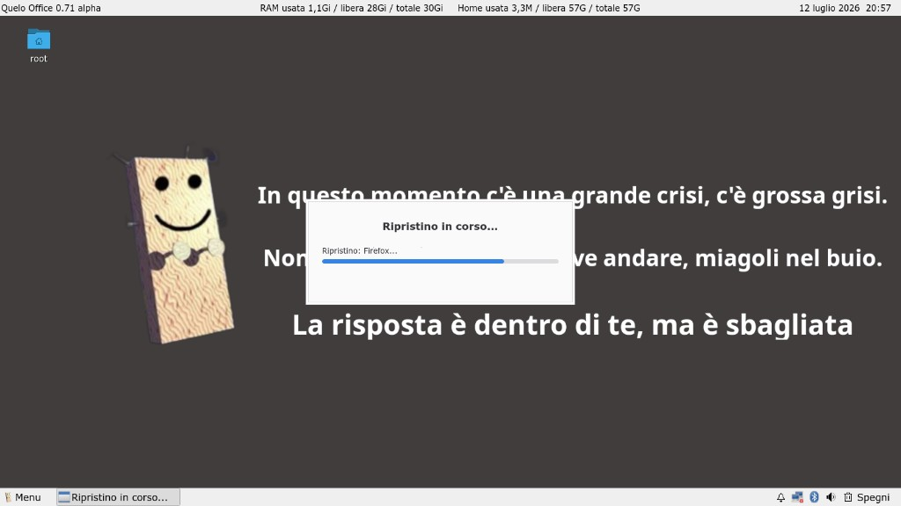
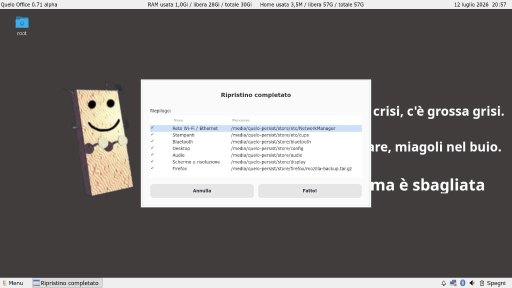
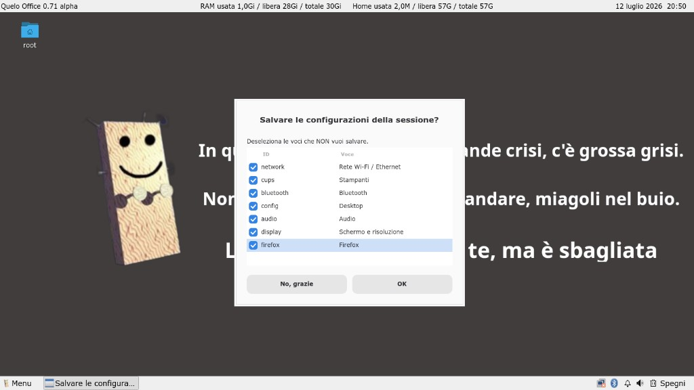
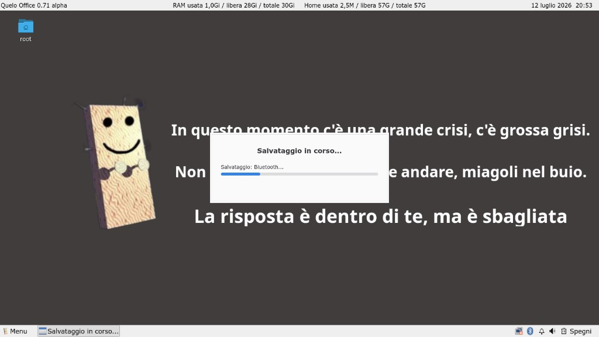
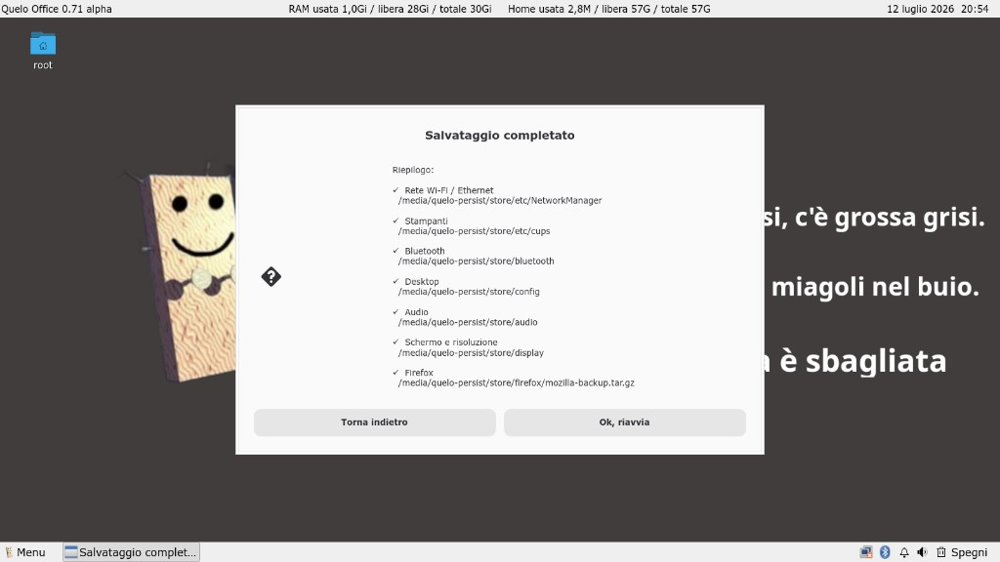
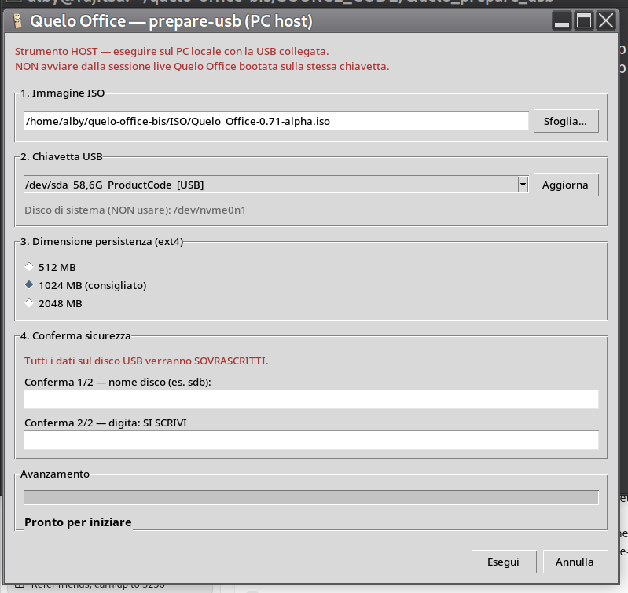

# Quelo Office

**Italiano** · [English](README.en.md)

**Quelo Office** è una distribuzione Linux live pensata per girare da chiavetta USB: un piccolo ufficio portatile, in italiano, pronto all’uso su quasi qualsiasi PC.

Ispirata al personaggio «Quelo» di Corrado Guzzanti, unisce la solidità di **Debian GNU/Linux** a un ambiente grafico leggero (**LXQt + Openbox**), senza la complessità di un’installazione tradizionale.

Release alpha attuale: **0.71** (`ISO/Quelo_Office-0.71-alpha.iso`).

Sito web: **https://alby-quelo.github.io/quelo-office/**




## A cosa serve

Quelo Office è pensata per chi vuole:

- portare con sé un **ufficio completo** (documenti, browser, posta via web, stampa, scanner);
- lavorare su **più PC** con la stessa chiavetta, senza toccare i dischi interni;
- avere **file personali leggibili anche da Windows e macOS** (partizione home in exFAT);
- salvare **solo le configurazioni che interessano** (rete, stampanti, desktop, audio, schermo, Firefox…), senza trasformare la live in un sistema opaco e difficile da aggiornare.


## Caratteristiche principali

### Sistema e desktop

- Basata su **Debian sid** (live-build), locale **italiano**, fuso orario **Europe/Rome**.
- Avvio diretto al desktop: autologin, **startx** e sessione **LXQt** con **Openbox** come window manager.
- **Due pannelli LXQt**:
  - in alto: versione, RAM usata, spazio home, orologio;
  - in basso: menu applicazioni, barra delle applicazioni, area di sistema (rete, Bluetooth, volume), cestino, spegnimento/riavvio.
- Menu personalizzato con logo Quelo; dimensione caratteri regolabile per menu e pannello inferiore.
- Risoluzione e layout multi-monitor gestibili con **lxrandr** (wrapper `quelo-lxrandr`).

### Applicazioni incluse

| Area | Software |
|------|----------|
| Ufficio | LibreOffice (interfaccia e correttore italiano) |
| Web | Firefox ESR (italiano) |
| Testo / PDF | Mousepad, Zathura |
| File | pcmanfm-qt (gestione file e desktop) |
| Immagini | lximage-qt (visualizzazione), mtPaint (fotoritocco) |
| Multimedia | SMPlayer (video), Audacious (audio) |
| Utilità | KCalc, lxterminal, Xarchiver, SMB4K, screenshot |
| Stampa / scanner | CUPS, driver estesi, Simple Scan |
| Rete | NetworkManager, firmware Wi‑Fi/LAN, modem mobile |
| Bluetooth | Blueman |

Font **Microsoft TrueType** (Arial, Times, Verdana…) per compatibilità con documenti Office.

### Hardware e connettività

- Ampia copertura **firmware di rete** (Intel, Realtek, Broadcom, Mediatek…).
- **Stampanti** di rete e USB (Avahi/mDNS, ipp-usb, molti driver).
- **Scanner** via SANE (anche airscan).
- **Bluetooth** con applet nel pannello.
- **Condivisioni di rete** Samba/CIFS con SMB4K.

### Comportamento live

- Ogni avvio riparte dall’**immagine ISO pulita**: niente overlay automatico stile «persistenza Debian live» che modifica silenziosamente `/usr` o i pacchetti di sistema.
- Cache e temporanei in **RAM** (`/tmp`, cache apt, ecc.) — la sessione resta snella.
- **Salvataggio selettivo della sessione**: al riavvio o allo spegnimento puoi scegliere cosa conservare tra rete, stampanti, Bluetooth, desktop, audio, schermo e Firefox. Il ripristino all’avvio è guidato da un dialogo analogo.
- I dati utente (documenti, download, immagini…) stanno sulla partizione **QUELO-HOME** in **exFAT**, montata automaticamente e collegata alle cartelle standard (Desktop, Documenti, Scaricati…).


## Schermate

### Desktop

Pannello superiore: versione, RAM, spazio home, orologio. Pannello inferiore: menu Quelo, barra applicazioni, rete, Bluetooth, volume, cestino, spegnimento.


### Ripristino all’avvio

Dopo ogni boot compare un dialogo che chiede quali settaggi ripristinare dalla partizione di persistenza. Puoi deselezionare le voci che non ti servono (utile se cambi monitor o rete).







### Salvataggio allo spegnimento

Dal pulsante **Spegni** (riavvio o spegnimento) puoi salvare in modo selettivo rete, stampanti, Bluetooth, desktop, audio, schermo e Firefox.








## Layout della chiavetta USB

Dopo la preparazione con `prepare-usb.sh`, la chiavetta contiene tre zone logiche:

```
┌─────────────────────────────────────────────────────────┐
│  Partizione 1–2  │  ISO live (sola lettura al boot)     │
├──────────────────┼──────────────────────────────────────┤
│  Partizione 3    │  ext4 «persistence» — config Linux   │
│                  │  (invisibile a Windows/macOS)        │
├──────────────────┼──────────────────────────────────────┤
│  Partizione 4    │  exFAT «QUELO-HOME» — i tuoi file    │
│                  │  (leggibile ovunque)                 │
└──────────────────┴──────────────────────────────────────┘
```

La dimensione della partizione di persistenza la scegli tu durante la preparazione (es. 128 / 256 / 512 MB o più).


## Come si usa

### 1. Scarica i file

File ufficiale ISO: **`Quelo_Office-0.71-alpha.iso`**

Pacchetto prepare-usb (script preparazione chiavetta), in tre formati — pacchetto **completo** (CLI + GUI):

| Formato | File |
|---------|------|
| ZIP | `Quelo_prepare_usb-0.71-alpha.zip` |
| RAR | `Quelo_prepare_usb-0.71-alpha.rar` |
| TAR | `Quelo_prepare_usb-0.71-alpha.tar` |

Pacchetto **solo GUI** (interfaccia grafica Linux):

| Formato | File |
|---------|------|
| ZIP | `Quelo_prepare_usb_gui-0.71-alpha.zip` |
| RAR | `Quelo_prepare_usb_gui-0.71-alpha.rar` |
| TAR | `Quelo_prepare_usb_gui-0.71-alpha.tar` |

Tutti i download: **https://github.com/alby-quelo/quelo-office/releases/tag/0.71-alpha**

### 2. Prepara la chiavetta USB

**Importante:** la preparazione va fatta **sul PC di casa o dell’ufficio**, **mai** avviando Quelo Office dalla stessa chiavetta che stai scrivendo.

#### Opzione A — GUI grafica (consigliata, Linux)

```bash
# Dopo aver estratto l'archivio prepare-usb-gui (o il pacchetto completo):
cd Quelo_prepare_usb_gui   # oppure Quelo_prepare_usb
./prepare-usb-gui.sh
```



L’interfaccia guida la scelta di ISO, chiavetta USB e dimensione persistenza (512 / 1024 / 2048 MB), con doppia conferma di sicurezza e messaggi di avanzamento descrittivi. Al termine la finestra si chiude da sola.

**Prerequisiti sul PC host (GUI):**

| Pacchetto | Uso |
|-----------|-----|
| `python3`, `python3-tk` | Interfaccia grafica |
| `e2fsprogs` | Formattazione ext4 (persistenza) |
| `exfatprogs` | Formattazione exFAT (QUELO-HOME) |
| `util-linux` | fdisk, wipefs, sfdisk, lsblk, dd |
| `polkit` (pkexec) o `sudo` | Privilegi root |

Installazione rapida (Debian/Ubuntu):  
`sudo apt install python3 python3-tk e2fsprogs exfatprogs util-linux polkit-1`

#### Opzione B — Script a terminale (CLI)

```bash
cd Quelo_prepare_usb
sudo ./prepare-usb.sh
```

**Prerequisiti sul PC host (CLI):** `e2fsprogs`, `exfatprogs`, `util-linux` (fdisk, dd, wipefs…).

Lo script guida nove passi con pause e doppia conferma di sicurezza (`SI SCRIVI`).

**Download prepare-usb** (dalla [Release 0.71-alpha](https://github.com/alby-quelo/quelo-office/releases/tag/0.71-alpha)):

| Pacchetto | Formati |
|-----------|---------|
| Completo (CLI + GUI) | `Quelo_prepare_usb-0.71-alpha.{zip,rar,tar}` |
| Solo GUI Linux | `Quelo_prepare_usb_gui-0.71-alpha.{zip,rar,tar}` |

La GUI Linux (release 0.71-alpha) include la correzione per la partizione **QUELO-HOME**
exFAT su Windows (tipo partizione 0x07). Vedi `CHANGELOG.TXT`.

#### Opzione C — GUI grafica (Windows 7+)

**Ancora in preparazione** — non scaricare da questa release; verrà pubblicata
in un aggiornamento successivo.

### 3. Avvia dal BIOS/UEFI

Seleziona l’avvio da USB. Al primo login trovi il desktop pronto; se hai creato QUELO-HOME, le tue cartelle personali sono già collegate.

### 4. Spegnimento e sessione

Il pulsante **Spegni** nel pannello offre riavvio o spegnimento e, se vuoi, il **salvataggio selettivo** delle configurazioni prima di uscire.


## Perché uno script separato per la chiavetta?

All’inizio del progetto esisteva un **wizard al primo avvio** dentro la live, che partizionava la USB mentre ci si bootava sopra. È stato **rimosso** e sostituito da **`prepare-usb.sh`**, eseguibile solo dal sistema host. I motivi:

1. **Sicurezza** — Operazioni come `dd`, `fdisk` e `mkfs` sono distruttive se puntano al disco sbagliato. Dal sistema host, con controlli su dispositivo removibile, doppia conferma e divieto esplicito di scrivere sul disco di boot, il rischio cala drasticamente. Dalla live bootata **sulla stessa USB** quei controlli sono molto più fragili.

2. **Affidabilità** — Ridimensionare e formattare il disco da cui si sta avviando è tecnicamente delicato (partizioni in uso, cache, race con il kernel). Sul PC host la USB è un dispositivo esterno libero: la scrittura dell’ISO e la creazione delle partizioni sono prevedibili.

3. **Un’ISO per tutti** — L’immagine live resta **identica e universale**: la scarichi, la verifichi, la condividi. Ogni utente prepara **la propria** chiavetta (dimensione persistenza, cartelle home, capacità del supporto) **dopo**, senza varianti dell’ISO.

4. **Libertà di strumenti** — Puoi scrivere l’ISO anche con **Balena Etcher** o altri programmi, e usare lo script solo per aggiungere persistenza e QUELO-HOME. Oppure fare tutto in un unico passaggio con `prepare-usb.sh` (scrittura + partizioni + formattazione).

5. **Separazione dei ruoli** — La **ISO** definisce il sistema Quelo Office; lo **script USB** definisce *come* lo installi sul supporto fisico. Aggiornare la distro (nuova ISO) non obbliga a rifare la logica di partizionamento dentro la live.

In sintesi: **la live serve per lavorare; il PC host serve per preparare la chiavetta in sicurezza.**


## Sviluppo e sorgenti

Il codice di build e gli script USB sono in **`SOURCE_CODE/`**:

| Cartella | Contenuto |
|----------|-----------|
| `Quelo_office/` | Build ISO (live-build, overlay, hooks) |
| `Quelo_prepare_usb/` | `prepare-usb.sh`, `prepare-usb-gui.sh`, `prepare-usb-gui.py`, `quelo_prepare_lib.py`, `quelo-write-iso.py` |

Dalla live, `quelo-export` (in `QUELO-HOME/quelo-export/`) raccoglie pacchetti e configurazioni aggiunte durante i test, per integrarle nei sorgenti e rigenerare l’ISO.

Documenti legali: **`LICENSE.TXT`**, **`CREDITS.TXT`** (root del repository).


## Avvertenza

> **Avvertenza.** Quelo Office è distribuito «così com'è», senza garanzie di alcun tipo, espresse o implicite. È realizzato a **scopo didattico e sperimentale**: non sostituisce l'assistenza professionale né garantisce il corretto funzionamento su ogni hardware o l'esito delle operazioni su dischi, sistemi o reti. L'uso è a proprio rischio; l'autore non risponde di danni diretti o indiretti derivanti dall'uso dell'ISO, degli script o delle istruzioni pubblicate.


## Licenza

Il lavoro originale Quelo Office è rilasciato sotto **Creative Commons BY-NC 4.0**. Uso didattico e non commerciale consentito con attribuzione; uso commerciale solo con autorizzazione scritta di **Alberto Frosio** (`alby@gnumerica.org`).

I software inclusi nell’ISO restano soggetti alle rispettive licenze (Debian, LibreOffice, Firefox, ecc.) — vedi `LICENSE.TXT` e `CREDITS.TXT`.
